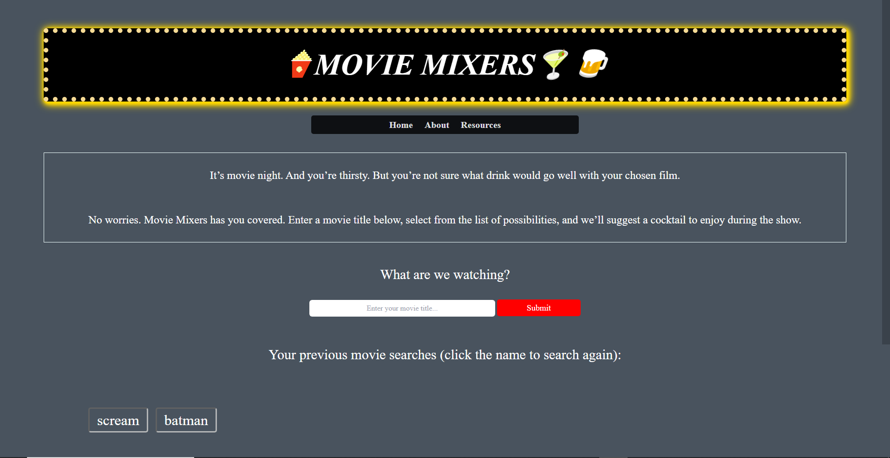
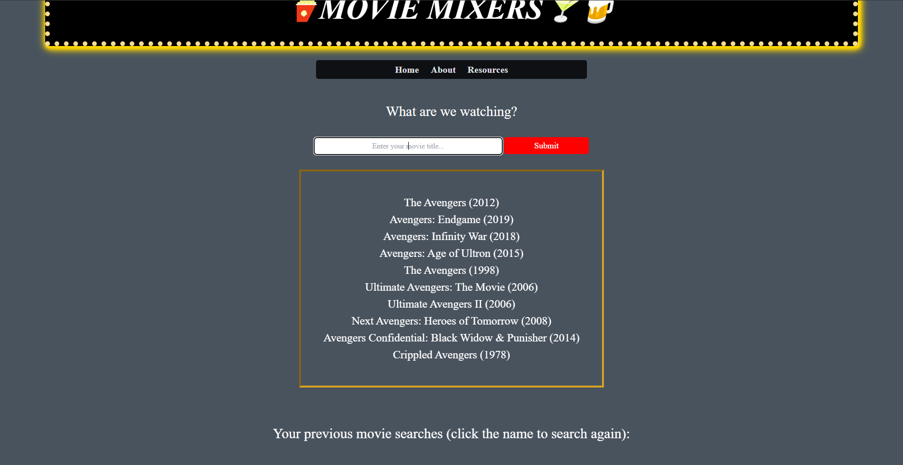

    ## Movie Mixers - Project README 
Project 1 for Bootcamp: Used a CSS framework, successful application on Github Pages, interactive application, manipulated two server-side APIs, used client-storage in order to store persistent data.

# Project Name
MOVIE MIXERS - MJ came up with this name when we were initially trying to create project name. We agreed to it because it reflects our goal of mixing the two (drinks and movies) together.

# Motivation 
We created this project to apply a CSS framework, manipulate two server-side APIs, and give users the ability to find the perfect pairing of movie and drink.

# Description
MOVIE MIXERS is a site that invites the user to search for a movie, to which the minds behind Movie Mixers match a mixed drink to be enjoyed with the film. The relationship between the movie and the drink largely comes from the genre of the movie and the name of the drink. Horror films are linked to drinks such as "Bloody Punch" or "Corpse Reviver"; crime films get linked to drinks such as "Death in the Afternoon" and "Shot-gun"; drama films go nicely with "Absolutly Screwed Up" and "Affair." 

Our web application uses two server-side APIs (Open Movie Database and Cocktail Database) to supply us with movie info and drink details. Client storage provides the user with a search history so they can quickly get a drink recommendation for the movies they watch over and over. 

We provide the drink ingredients and a step-by-step recipe on how to make the drink. We also provide a plot synopsis for the film, in case you are trying out a new flick (or can't remember the story of an old flick).

In the about page, you can find out the developers' favorite movie and drink pairing. In the resources page, it mirrors an open source page by sharing what APIs were used and gives depth to how big our storage is.  

# Visuals
 
  
  This is a screenshot of what it looks like when you successfully matched a drink and a movie together. It shows the recipe too! 
 
# Installation
- To launch the deployed application, click here: https://project01team02.github.io/movie-mixers/.
 
- To edit and look at the code closer, first install vscode (https://code.visualstudio.com/download), then do GitHub clone, and will launch the application. 

# Usage
When the user opens the site they start on the home page where they see the brand statement, the search from, and the search history. They can type a search query in the form and submit it. The search query will be saved into the history. The user can click on any query in the history to search for it again. The display will show all movies that have the words of their search query in the title. The movies are displayed with the title and year. The user can click on the movie they want to generate a movie and drink pairing. The pairing is shown on screen. The left side of the screen shows the movie title, an image of the poster, and a short summary of the plot. The right side shows the name of the drink, its ingredients, and instructions on preparing it.

# Support
You can reach out to one of the developer(s) by email to report an issue: eddiefriedman1@gmail.com

# Authors and acknowledgment
Developers: Christopher Clair, Peter Conenna, Andrew Forbes, Edward Friedman.
 
 
Name for this Project: MJ Shelton. 

# Dependencies
We used the following two APIs for this project: 
 
- www.thecocktaildb.com 
 
- www.omdbapi.com
 
 
They were combined (**mixed**, if you will) to make our website.

# Project status
Project ongoing as of 5/17/23.